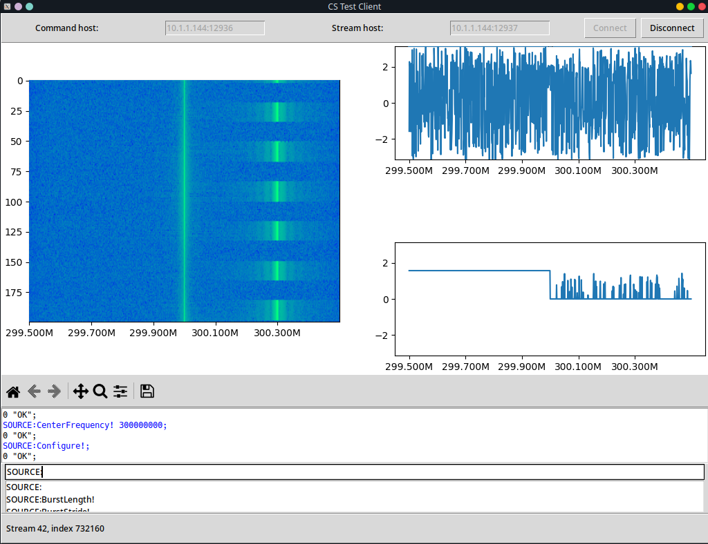

# README #

Simple test client for CoreService written in Python.

## Requirements

 * Python3 with tkinter

### Required pip packages

 * Numpy
 * Matplotlib

### Additional required pip packages for compass sensors

 * scipy
 * pyusb
 * pyftdi
 * ahrs
 * pyquaternion

# CS Test Client

## How to use

Start `cstestclient.py` using Python 3.

```bash
python cstestclient.py
```



 1. Fill the *Command host* and *Stream host* textboxes in `<hostname>:<tcp port>` format.
 2. Click the *Connect* button and make sure the status bar (bottom) says `Connected`.
 3. Send the desired commands to the CoreService via the command input box. Press the Return (Enter) key to send.
    * Use the autocomplete feature: press the *Tab* key to fill in the first suggestion, use the *Up*/*Down* key to browse the suggestions.
    * Command history are stored as suggestions in the `commands.txt` file.
 4. Magnitude waterfall plot, azimuth and elevation plots can be observed in the middle panel. Use the toolbar to interact with the plots.


## Options

Display only 2048 bins and 100 packets on the graph with 10 frames per second (useful on slower machines):

```bash
python cstestclient.py --bin 2048 --wf 100 --fps 10
```

Display packet types only and do not show matplotlib graphs at all:

```bash
python cstestclient.py --no-disp
```

Display ROI azimuth and elevation waterfall instead of spectrum:

```bash
python cstestclient.py --roi-wf
```

Include ROI antenna phase differences on the azimuth and elevation waterfall:

```bash
python cstestclient.py --roi-wf --phases-roi-wf
```

Use a compass sensor on serial port `COM1`:
```bash
python cstestclient.py --roi-wf --sensor-dev COM1
```

# Compass tester

## How to use

Start `compass_tester.py` using Python 3. Specify the sensor type in the command line arguments.

```bash
python compass_tester.py --sensor-dev COM1
```

```bash
python compass_tester.py --aaronia
```
