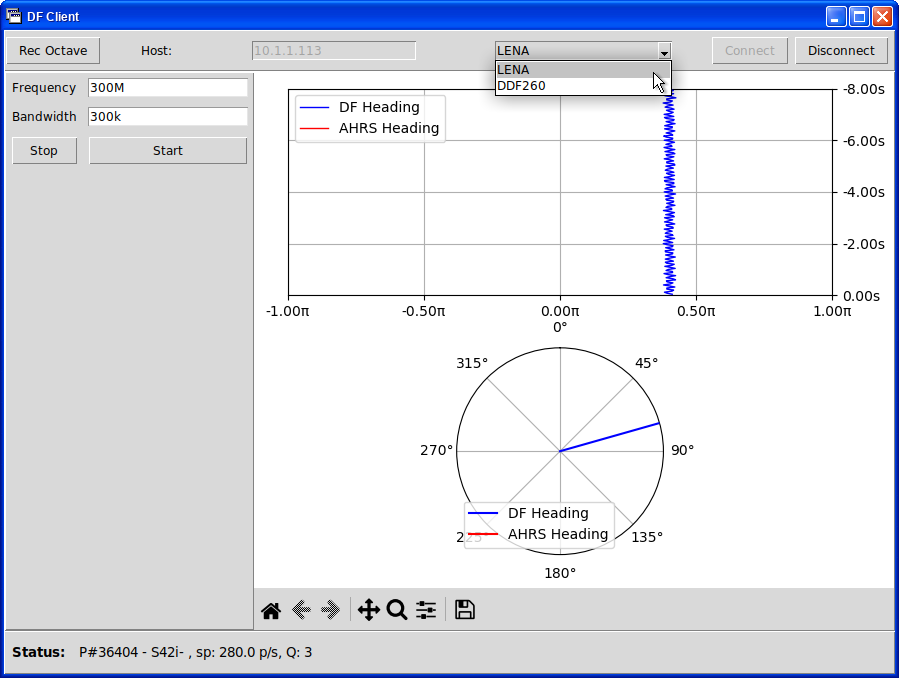
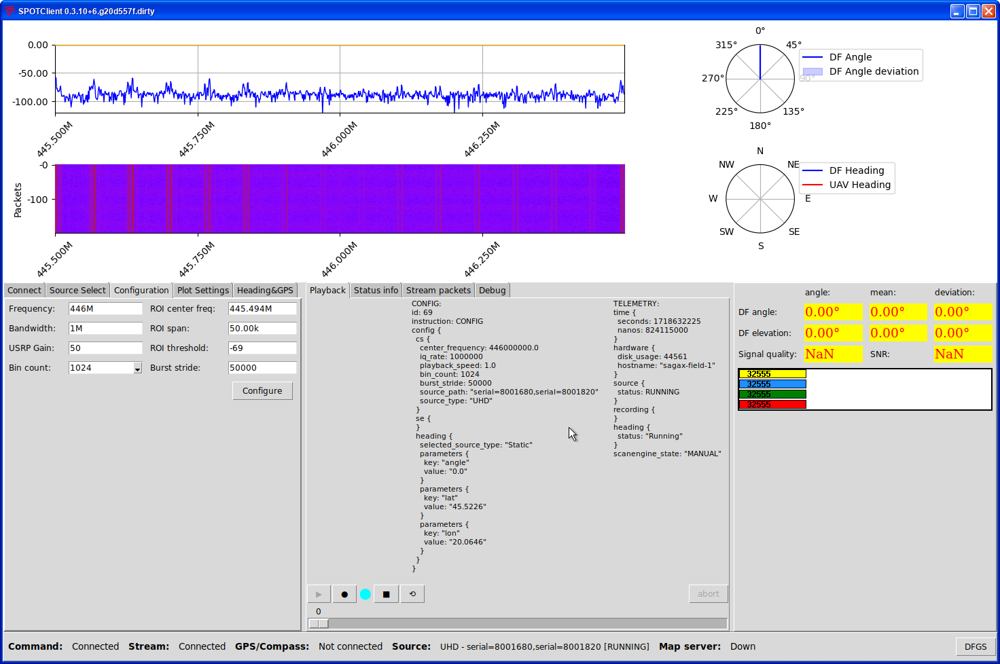
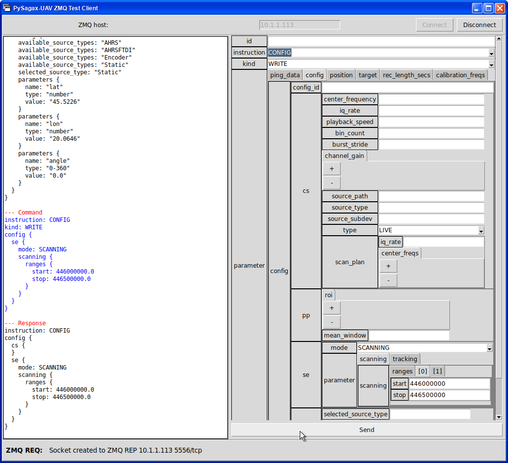
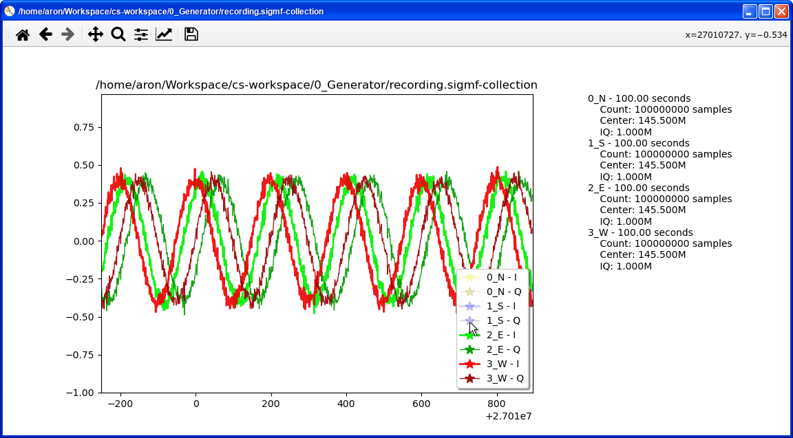
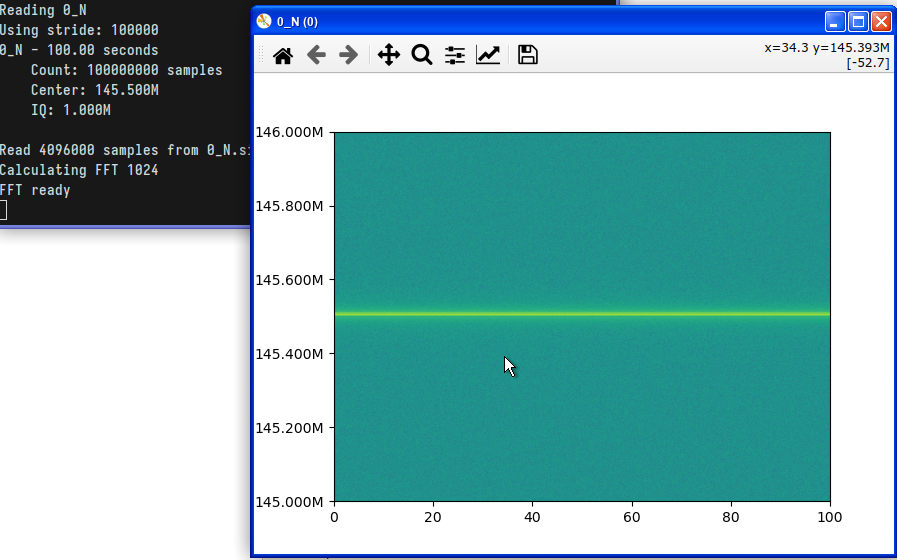

# README #

Collection of Sagax LENA-related python software. The `pysagax` package contains both the server (DF receiver) side and client GUI programs.

## Requirements

 * Python3 with tkinter

```bash
# On Ubuntu
apt install python3 python-is-python3 python3-pip python3-tk python3-pil python3-pil.imagetk 
```

### Installing from wheel file

```bash
cd Downloads  # wheel file location
pip install pysagax-0.x.xx-py3-none-any.whl  # substitute x with current version
# After installing, the tools are in the user PATH (~/.local/bin)
spotclient  # runs SPOTClient
```

### Required pip packages

If not installed from wheel, but run from source, you will need to install the project dependencies using `pip`.

```bash
pip install -r requirements.txt
```

PyEnv can be used to isolate from system package installation

```bash
cd sgx-pc
PYENV_HOME=./.venv
python -m venv $PYENV_HOME
source $PYENV_HOME/bin/activate

$PYENV_HOME/bin/python -m pip install --upgrade pip
$PYENV_HOME/bin/pip install -r requirements.txt
PYTHONPATH=$PWD $PYENV_HOME/bin/python pysagax/spotclient.py  # run SPOTClient 
```

# DFClient 



DFClient is a client software for any generic radio direction finding system. It uses a common interface for all the supported DF devices and a driver can be quickly implemented for one.
Its simple UI allows setting the center frequency and bandwidth of the receiver, and it displays the detected signal direction on both a time-angle waterfall graph and a compass rose.

Supported DF systems:

 * Sagax LENA
 * R&S®DDF260

```bash
dfclient  # if wheel file is installed
(cd sgx-pc; PYTHONPATH=$PWD python3 pysagax/dfclient.py)  # from source repo
```

# SPOTClient 



SPOTClient is a tool for manual configuration and operation of one LENA DF receiver. It is a useful tool for debugging and for doing both lab and field tests. 
Most of the capabilities of the LENA system can be accessed through the UI without using any other tool.

Features:


```bash
spotclient  # if wheel file is installed
(cd sgx-pc; PYTHONPATH=$PWD python3 pysagax/spotclient.py)  # from source repo
```

# ZMQTestClient



This tool is for manual testing of the PySAGAX-UAV or CoreService protobuf command interface. 
We can send an arbitrary command packet on the ZeroMQ Protobuf interface of these software and display the response for the command when it arrives. 
The tool allows setting any of the existing fields in the PySAGAX command protocol of the given version.

Note that the tool will only interact with the command interface, you will have to use another program for the stream port (spotclient or clizmqclient).

```bash
zmqtestclient  # if wheel file is installed
(cd sgx-pc; PYTHONPATH=$PWD python3 pysagax/zmqtestclient.py)  # from source repo
```


# clizmqcommander

CLIZMQCommander is for the same purpose ad the ZMQTestClient, but is used in the command line (for instance, if only an SSH connection is available). 
We can specify the command packet in JSON format.

Example:
```
$ PYTHONPATH=. ./pysagax/clizmqcommander.py 10.1.1.113
ZMQ REQ connecting to ZMQ REP 10.1.1.113 5556/tcp
ZMQ Connected
...
Protobuf JSON format docs: https://protobuf.dev/programming-guides/proto3/#json
=== Command JSON:
{"instruction":"INFO"}

...
=== Response:
{
  "instruction": "INFO",
  "info": {
    "hardware": {
      "hostname": "sagax-field-1"
    },
    "software": {
      "pysagaxVersion": "0.1.1"
    }
  }
}
```

# clizmqclient

This tool is used for displaying PySAGAX-UAV stream data on the command line. Example:

```
--- m -> MEASUREMENT
time {
  seconds: 1718635733
}
stream_id: 42
packet_id: 1
heading_data {
  timestamp {
    seconds: 1718632071
    nanos: 263867000
  }
  gps_lat: 45.52259826660156
  gps_lon: 20.064599990844727
}
data {
  data: "(2048 bytes)"
  center_frequency: 444600000.0
  bandwidth: 5600000.0
}

--- t -> TELEMETRY
time {
  seconds: 1718635733
  nanos: 516245000
}
hardware {
  disk_usage: 44561
  hostname: "sagax-field-1"
}
source {
  status: RUNNING
}
recording {
}
heading {
  status: "Running"
}
scanengine_state: "TRACKING_IN_PROGRESS"

```

After starting the program, you will need to send a STREAM START command to PySAGAX-UAV (using clizmqcommander or zmqtestclient):

```json
{
  "instruction": "STREAM_START",
  "target": {
    "level": "SPECTRUM",
    "address": "10.1.1.139",
    "port": 5050
  }
}
```

```bash
zmqtestclient -p 5050  # Listens on UDP port 5050 for PySAGAX-UAV
zmqtestclient -p 5050 -c 10.1.1.113:5556  # Does the same, but starts stream automatically (we have to specify the command host for that)
clizmqclient -p 12937 10.1.1.113  # Connects to CoreService ZMQ TCP stream port
```

# pysagax-heading 

```
TODO
```

# pysagax-uav 

```
TODO
```

# sigmfdisp 



We can display the time-domain signal in a SigMF recording.

```bash
sigmfdisp ./recording/recording.sigmf-collection
sigmfdisp /var/sagax/cs/20240205_Mon_095610/2_E.sigmf-meta
sigmfdisp /var/sagax/cs/20240205_Mon_095610/2_E.sigmf-data  # no metadata will be displayed
```

# sigmfspectrum 




Displays the spectrum of a SigMF recording efficiently, even for gigabyte sized recordings.
To do that, the program reads bursts with large strides, and therefore the graph will not be detailed on its time axis.
The main use case is to give an overview of a recording, and it can be useful to set the SigMF file associations to be opened using this software.
When metadata is present, the axes will be displayed in MHz for frequency and seconds for time.

```bash
sigmfspectrum ./recording/recording.sigmf-collection --show 0 --show 1 --save 1
# Channel 0 and 1 will be displayed, channel 1 spectrum will be saved to az npz file

sigmfspectrum /var/sagax/cs/20240205_Mon_095610/2_E.sigmf-meta
sigmfspectrum /var/sagax/cs/20240205_Mon_095610/2_E.sigmf-data  # no metadata will be displayed
```

